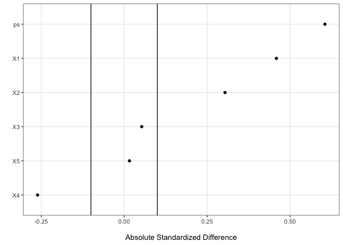
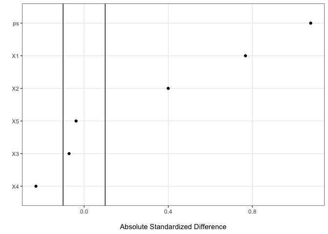

# EBalGen: Entropy balancing for covariate shift causal generalization

## Overview

<!-- badges: start -->

[](https://github.com/yc702/EBalGen/actions/workflows/R-CMD-check.yaml)
<!-- badges: end -->

### Introduction

The R package *EBalGen* provides tools for implementing exact and
approximate balancing methods for causal generalization based on the
work of Chen, Chen and Yu (2023) and Chen, Chen and Yu (2025+). The key
idea is that for causal generalization, differences in the distributions
of treatment effect modifiers between these populations, known as
covariate shift, can lead to varying ATEs. We introduced a weighting
method to estimate the target ATE and CI use only summary-level
information from a target sample while accounting for the possible
covariate shifts.

### Key Functionalities

*EBalGen* provides the following functionalities:

- Weight: Compute both exact and approximate balancing weights to
  account for covariate differences between the source and target
  populations and within source population.

- ATE: Estimate the average treatment effect (ATE) using the computed
  weights.

- Confidence Interval (CI): Construct CI for the estimated ATE using
  resampling-based perturbation method (RPM).

## Installation

You can install the development version from
[GitHub](https://github.com/) with:

``` r
# install.packages("devtools")
devtools::install_github("yc702/EBalGen")
```

Load the package with

``` r
library(EBalGen)
```

## Example 1: Source and target population have a good overlap.

### Data Set up

- We set the total sample size $n = n_s +n_t= 800$ which is split into
  source $n_s = 401$ and target $n_t = 399$ samples. We generate 5
  covariates $X = (X_1, \ldots, X_5)$ from a uniform distribution
  $U(-2, 2)$.

- The source/target participation probability $\rho (x)$: it follows
  $\text{logit} \{ \rho (x) \} = 0.4x_1+ 0.3x_2-0.2x_4$. That is, there
  is shift in the distribution of $(X_1, X_2, X_4)$.

- Propensity score $(\pi(x))$ model: we assume the treatment assignment
  is related to $H$ linearly with
  $\text{logit}\{\pi(x)\} = 0.7x_2 + 0.5 x_3$. In this case, all the
  confounders are included in $H$, and it is enough that we only balance
  on $H$ to account for confounding.

- Outcome model: we assume
  $Y_i = m(X_i) + (A_i-0.5) \tau(X_i) + \epsilon_i$ with
  $\epsilon_i \overset{\text{i.i.d}}{\sim} N(0,1)$.

- CATE function: we assume \$(x) = x_1 - 0.6x_2 - 0.4 x_3 \$. For the
  main effect $m(x)$, it has the form of
  $m(x) = 0.5x_1 + 0.3x_2 +0.3x_3 - 0.4 x_4 - 0.7 x_5$.

In this setting, the Average treatment effect for target (ATET) is
-0.138

### Propensity scores distribution between source and target samples

The plot here visually checks the propensity scores of source and target
samples fitted using simple logistic regression using all 5 covariates.
The distribution of propensity scores in both populations shows a
substantial degree of overlap, indicating that the covariate
distributions between the two samples are sufficiently similar. This
overlap suggests that the generalization of treatment effects from the
source population to the target population is more reliable and exact
balancing could be achieved.


Additionally, we show the standardized mean difference (SMD) plot.



### Compute exact balancing weights and generalized ATE

For causal generalization, assume in the target sample we only have
summary-level information of $X_1, X_2,$ and $X_3$ to be balanced. We
set $H(x) = (1, x_1, x_2, x_3)$ and $G(x) = (x_4, x_5)$.

**Data input:**

- `xs` A data matrix for the source sample. Each column represents
  source sample covariate and each row represents an observation.

- `ys` A vector of the source sample response values.

- `trts` A vector of 0, 1 or TRUE/FALSE of treatment assignment for the
  source sample.

- `H_vars` A vector of numbers indexing which covariate in the source
  sample need to be balanced between source and target samples. Here we
  balance on 1,2,3 covariates.

- `target_moments`A vector of first moments of the target sample
  covariates that needs to be balanced between source and target. Here
  the values are -0.277, -0.139, -0.119.

- `delta` A vector specifying the approximate balancing tolerance
  margin. Here the values are (0, 0, 0, 0, 0, 0, 0, 0). For the delta’s
  length of 8, it is balancing between source and target and within
  source: 3+3+2.

Here is the summary statistics of the weights for the source sample.

``` r
library(EBalGen)

## Source sample
wts_gen <- ebal_wts(xs, trts,H_vars, target_moments,H_add_intercept = TRUE,delta )$w
summary(wts_gen)
#>    Min. 1st Qu.  Median    Mean 3rd Qu.    Max. 
#>  0.2415  1.0163  1.5952  2.0000  2.5774 14.0762
```

Here is the generalized target ATE.

``` r

ebal_ATE(xs,ys,trts,H_vars, target_moments, H_add_intercept=TRUE,delta)$ATE
#>      value 
#> 0.02294481
```

### Compute exact balancing CI

Use resampling-based perturbation `RPM_CI()` with additional input of
`target_sd` and the number of bootstrap iteration 300.

- `target_sd` A vector of standard deviation of the target sample
  covariates that needs to be balanced between source and target.

``` r
## CI construction
target_sd = colStdevs(xt)[H_vars]
ATE_CI = RPM_CI(xs, ys,trts, H_vars=H_vars,target_mean=target_moments,
                target_sd=target_sd,num_sim=300, H_add_intercept=TRUE,
                cluster=5, set_seed=100)

## Lower bound of 95% CI
ATE_CI$lb_ATE
#>      2.5% 
#> -2.130664

## Upper bound of 95% CI
ATE_CI$ub_ATE
#>    97.5% 
#> 2.310287
```

------------------------------------------------------------------------

## Example 2: Source and target population have bad overlap

### Data Set up

We set the total sample size $n = n_s +n_t= 400$ which is split into
source $n_s = 281$ and target $n_t = 119$ samples. We generate 5
covariates $X = (X_1, \ldots, X_5)$ from a uniform distribution
$U(-2, 6)$. The remaining settings are identical to those in the
previous example.

In this setting, the Average treatment effect for target (ATET) is
-0.641

### Propensity scores distribution between source and target samples

The plot here visually checks the propensity scores of source and target
samples fitted using simple logistic regression using all 5 covariates.
The distribution of propensity scores in both populations shows a
limited degree of overlap, indicating that the covariate distributions
between the two samples are quite different. This overlap suggests that
approximate balancing should be used.


Additionally, we show the SMD plot. We can see that the SMD is much
larger than in the case previously.



### Compute exact balancing weights and generalized ATE

For data input, everything are the same except we now have the
approximate balancing tolerance margin `delta` as all 0.1:(0.1, 0.1,
0.1, 0.1, 0.1, 0.1, 0.1, 0.1).

Here is the summary statistics of the weights for the source sample.

``` r
library(EBalGen)

## Source sample

wts_gen <- ebal_wts(xs, trts,H_vars, target_moments,H_add_intercept = TRUE,
                    delta=numeric(8)+0.1 )$w
summary(wts_gen)
#>     Min.  1st Qu.   Median     Mean  3rd Qu.     Max. 
#>  0.04555  0.33305  0.75514  2.00001  1.85307 93.90129
```

Here is the generalized target ATE.

``` r

ebal_ATE(xs,ys,trts,H_vars, target_moments, H_add_intercept=TRUE,
         delta=numeric(8)+0.1)$ATE
#>     value 
#> -1.046427
```

### Compute approximate balancing confidence interval

Use resampling-based perturbation `RPM_AB()` with additional input of
`target_sd` and the number of bootstrap iteration 300.

``` r
## CI construction
target_sd = colStdevs(xt)[H_vars]
ATE_CI = RPM_AB(xs, ys,trts, H_vars=H_vars,target_mean=target_moments,target_sd=target_sd,num_sim=300, H_add_intercept=TRUE,cluster=5, set_seed=100)

## Lower bound of 95% CI
ATE_CI$lb_ATE
#>      2.5% 
#> -2.807896

## Upper bound of 95% CI
ATE_CI$ub_ATE
#>   97.5% 
#> 4.54158

## Number of simulations that uses exact balancing over 300
ATE_CI$use_exact
#> [1] 67
```

## Reference

- Chen, R., Chen, G., and Yu, M. (2023). Entropy balancing for causal
  generalization with target sample summary information. Biometrics 79,
  3179–3190.

- Chen, Y., Chen, G., and Yu, M. (2025+). Confidence Interval
  Construction for Causally Generalized Estimates with Target Sample
  Summary Information.
